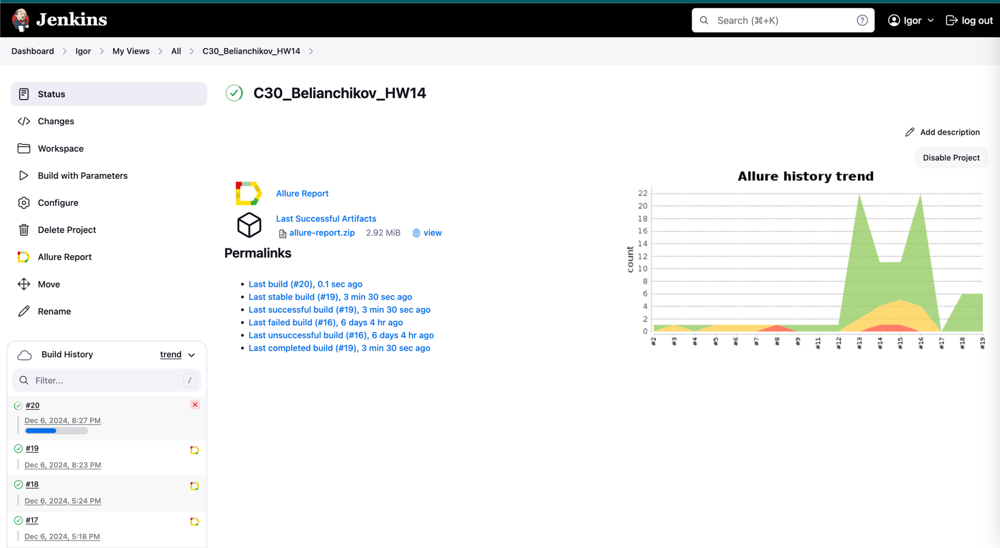
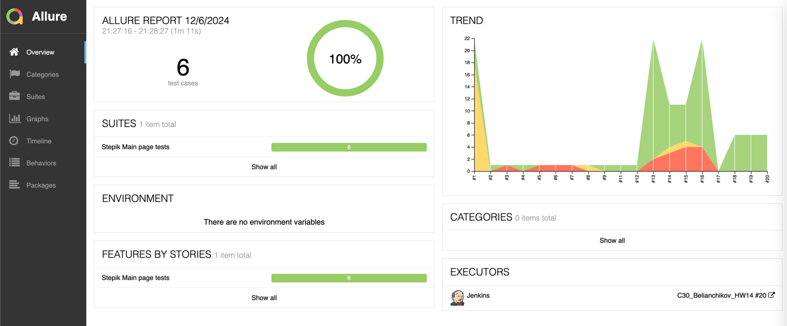
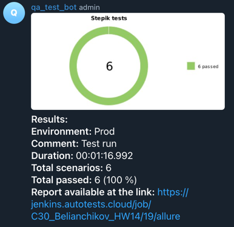
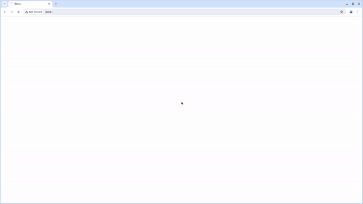

# Tests cases for [Stepik.org](https://stepik.org/) as homework for qa.guru:

### Содержание

* <a href="#project">Проект</a>
* <a href="#jenkins">Jenkins</a>
* <a href="#tools">Технологии и инструменты</a>
* <a href="#allure">Allure Report</a>
* <a href="#bot">Отчёт в telegram</a>

---
<a id="project"></a>
## <a name="Проект:">**Проект**</a>


- Написать автотесты
- Выложить проект на GitHub
- Создать задачу в Jenkins
- Вывести отчет в Allure
- Получить уведомление о прохождении тестов в Telegram Bot

---
<a id="tools"></a>
## <a name="Технологии и инструменты:">**Технологии и инструменты:**</a>

<p align="center">  
<a href="https://www.jetbrains.com/idea/"></a>  
<a href="https://www.java.com/"></a>  
<a href="https://github.com/"></a>  
<a href="https://junit.org/junit5/"></a>  
<a href="https://gradle.org/"></a>  
<a href="https://selenide.org/"></a>  
<a href="ht[images](images)tps://github.com/allure-framework/allure2"></a>  
<a href="https://www.jenkins.io/"></a>  
<a href="https://aerokube.com/selenoid/"></a>  
</p>

---

<a id="tests"></a>
## <a name="Список проверок:">**Список проверок**</a>

* Проверка наличия поля поиска на главной странице
* Проверка наличия кнопки выбора языка на главной странице
* Проверка наличия кнопки Логина на главной странице
* Проверка наличия кнопки Регистрации на главной странице
* Проверка наличия ссылки на telegram на главной странице
* Проверка наличия раздела рекомендованных курсов на главной странице

---

<a id="jenkins"></a>
## <a name="Jenkins:">**Jenkins**</a>

Сборка [Jenkins](https://jenkins.autotests.cloud/job/C30_Belianchikov_HW14/)



В качестве параметров можно выбрать:

- Browser
- Screen size
- Browser version

## Команды для запуска из терминала

Удалённый запуск через Jenkins:

```
clean 
stepik_test 
-Dbrowser=${browser}
-Dbrowser_version=${browser_version}
-DselenoidURL=${selenoidURL}
-Dbrowser_size=${browser_size}
```

---
<a id="allure"></a>
## <a name="Allure Report:">**Allure Report**</a>

Отчет о прохождениии тестов
в [Allure Report](https://jenkins.autotests.cloud/user/igorigor/my-views/view/all/job/C30_Belianchikov_HW14/allure/)



---
<a id="bot"></a>
## <a name="Telegram Report:">**Telegram Report**</a>

Уведомление о прохождении тестов в Telegram:



---
<a id="video"></a>
## <a name="Видео о прохождении тестов:">**Видео о прохождении тестов**</a>

<p align="center">
   
</p>
